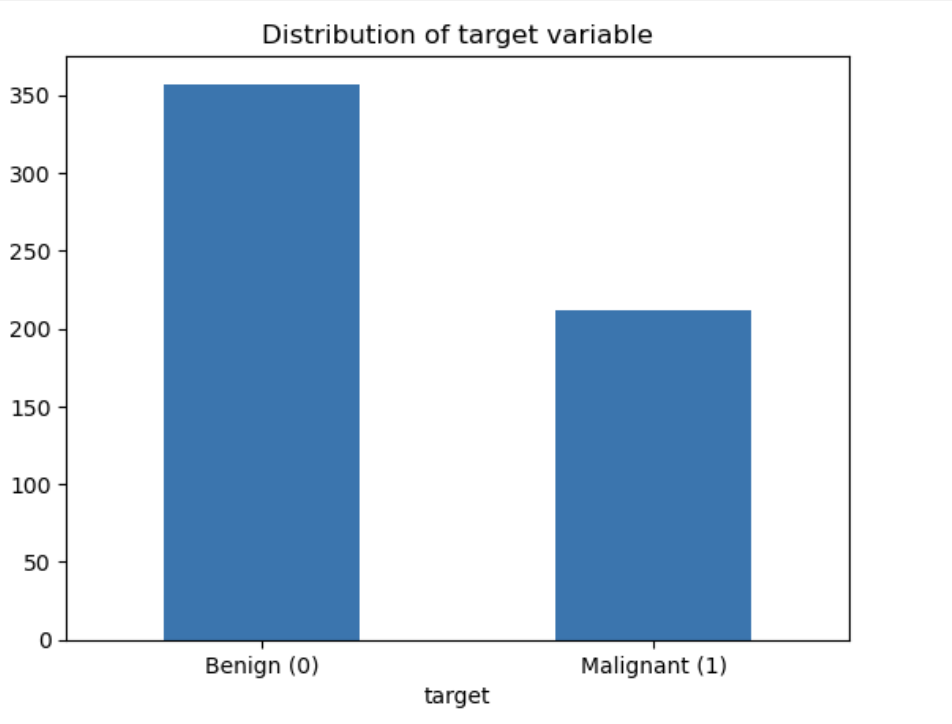
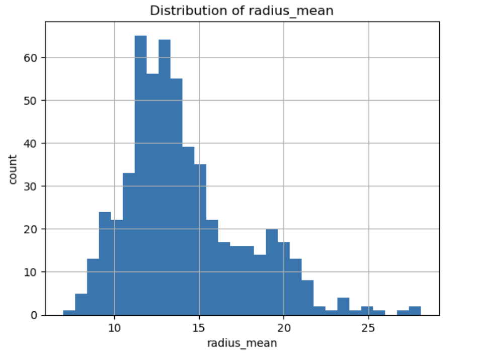
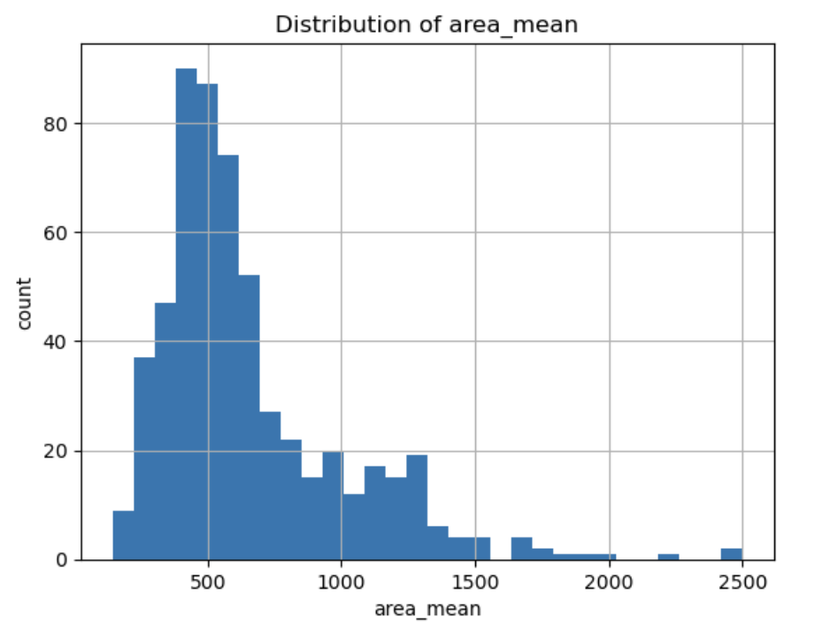
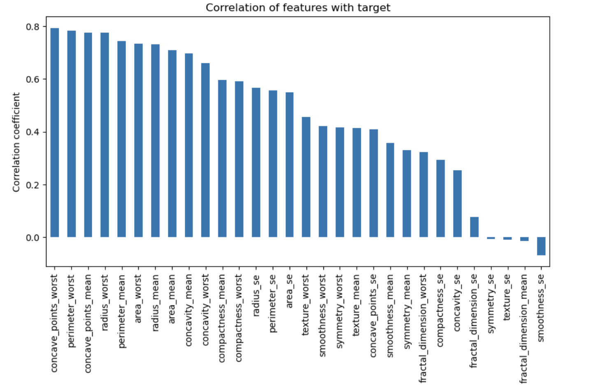
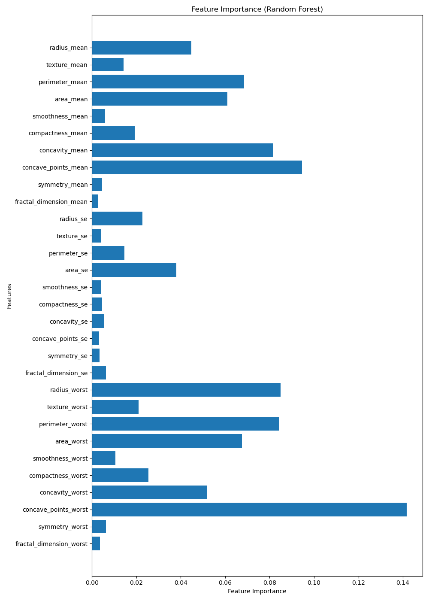

# 🎀 Breast Cancer ML Detection Project

## 🧪 Problem Description

Breast cancer is one of the most common cancers worldwide. Early detection significantly improves patient survival rates, but diagnosis often requires time-consuming manual evaluation by medical specialists.

This project aims to build a machine learning classifier that automatically predicts whether a breast tumor is:

- benign (non-cancerous)
- malignant (cancerous)

using 30 numerical diagnostic features extracted from digitized breast imaging data.

The goal is to provide a lightweight, reproducible, and portable decision-support tool that:

- assists practitioners or automated systems in screening patients
- speeds up diagnostic workflows
- reduces manual workload
- offers consistent prediction results across environments

The model and prediction pipeline can be executed directly on a local machine or inside a Docker container, ensuring portability and reproducibility.

⸻

## 📑 Table of Contents

- [🧪 Problem Description](#-problem-description)
- [📂 Project Structure](#project-structure)
- [📊 Dataset](#dataset)
- [🧬 Dataset Features](#dataset-features)
- [📥 Installation](#installation)
  - [📦 Virtual Environment (Recommended)](#virtual-environment-recommended)
- [📊 Exploratory Data Analysis (EDA)](#exploratory-data-analysis-eda)
  - [1. Class Distribution](#1-class-distribution)
  - [2. Feature Distributions](#2-feature-distributions)
  - [3. Correlation Heatmap](#3-correlation-heatmap)
  - [4. Feature Importance](#4-feature-importance)
- [🤖 Model Training Logic](#model-training-logic)
- [🏋️‍♀️ Train the Model](#train-the-model)
- [🔮 Run Predictions](#run-predictions)
- [🐳 Deployment (Docker + Flask API)](#deployment-docker--flask-api)
  - [🛠️ Build the Container](#build-the-container)
  - [🚀 Run the API Service](#run-the-api-service)
  - [📤 Send a POST Request](#send-a-post-request)
- [☁️ Cloud Deployment (Render)](#cloud-deployment-render)
- [♻️ Reproducibility](#reproducibility)

⸻

## 📂 Project Structure

```
breast-cancer-project/
│
├── breast-cancer.csv        # dataset
├── Notebook.ipynb           # EDA & model development
├── train.py                 # training script (exports model_rf.bin)
├── predict.py               # prediction script
├── model_rf.bin             # final trained Random Forest model
├── requirements.txt         # dependencies
└── Dockerfile               # container setup
```
⸻

## 📊 Dataset

The dataset used for this project is the Breast Cancer Diagnostic Dataset, available on Kaggle:

🔗 Source:
https://www.kaggle.com/datasets/yasserh/breast-cancer-dataset

This dataset contains diagnostic measurements extracted from digitized images of breast masses, aiming to classify tumors as benign or malignant based on numeric features.

⸻

## 🧬 Dataset Features

Each row describes one breast tumor using 30 numerical features derived from a digitized image of a fine-needle aspirate (FNA) of a breast mass.

Features include:
	•	Radius (mean distance from center to points on perimeter)
	•	Texture (standard deviation of gray-scale values)
	•	Perimeter, area, smoothness, compactness, concavity, symmetry, etc.
	•	All features are numeric and standardized.

Target Variable:
	•	diagnosis
	•	M → malignant
	•	B → benign

⸻

## 📥 How to Download the Dataset

You can download the dataset in two ways:

### 🔹 Option 1: Download directly from Kaggle UI

1. Go to the dataset page:  
   https://www.kaggle.com/datasets/yasserh/breast-cancer-dataset  
2. Click **Download**  
3. Unzip the file  
4. Place `breast-cancer.csv` into your project folder.


### 🔹 Option 2: Download using Kaggle API (Recommended)

If you have Kaggle API installed:

pip install kaggle

Login first (only needed once):

kaggle datasets download -d yasserh/breast-cancer-dataset

Then unzip: 

unzip breast-cancer-dataset.zip


### 📌 Note

For evaluation and reproducibility, the dataset file breast-cancer.csv is already included directly in this repository, so reviewers do not need to download anything manually.

⸻


## 📥 Installation

It is recommended to use a virtual environment when running this project.

### 📦 Virtual Environment (Recommended)

```bash
python3 -m venv venv
source venv/bin/activate        # Windows: venv\Scripts\activate
pip install -r requirements.txt
```


## 📊 Exploratory Data Analysis (EDA)

To better understand the dataset and identify patterns relevant to breast cancer diagnosis, several exploratory analyses were performed.

Below is a summary of the key EDA findings.


### 1. Class Distribution

The dataset shows a **moderate imbalance** between the two classes:

- **Benign (B)**: majority class  
- **Malignant (M)**: minority class  

📌 *This matters because imbalance can affect model performance.*




### 2. Feature Distributions

The 30 diagnostic features were visualized using histograms.

**Key observations:**

- Many features (e.g., radius, texture, area) show clearly different distributions for malignant vs benign tumors.
- Malignant tumors typically have larger radius, perimeter, and area.
- Some features are skewed and may benefit from scaling or normalization.




Malignant tumors (1) generally exhibit higher radius_mean and area_mean values.

---

### 3. Correlation Heatmap

A correlation heatmap was generated to identify relationships between features.



**Important findings:**

- Strong feature clusters exist (e.g., radius, perimeter, area).
- High correlations suggest that tree-based models like Random Forest can use redundancy effectively.

---

### 4. Feature Importance

After training the Random Forest model, feature importance values were extracted.

**Top contributing features typically include:**

- `radius_mean`
- `perimeter_mean`
- `concavity_mean`
- `area_mean`
- `concave_points_mean`

📌 *These features are biologically meaningful and align with medical understanding.*




## 🤖 Model Training Logic

The model is trained in two stages:

1. **Exploration & Model Selection (in `Notebook.ipynb`)**
   - Performed exploratory data analysis (EDA) to check:
     - Class balance between **benign (B)** and **malignant (M)**.
     - Distributions and ranges of the 30 numeric features.
     - Correlations between features and with the target.
   - Compared two model families:
     - **Logistic Regression** (linear baseline).
     - **Random Forest Classifier** (tree-based, non-linear).
   - Evaluated models on a validation split using metrics such as:
     - **Accuracy**
     - **ROC–AUC**
   - Random Forest slightly outperformed Logistic Regression on the validation set, so it was chosen as the final model family.

2. **Final Training Script (`train.py`)**

   The script `train.py` contains the minimal, reproducible training pipeline:

   1. **Load data**
      ```python
      df = pd.read_csv("breast-cancer.csv")
      ```

   2. **Basic preprocessing**
      - Normalize column names:
        - lower-case all names  
        - replace spaces and dashes with underscores
      - Encode the target:
        - `diagnosis` → `target` where  
          - `M` → `1` (malignant)  
          - `B` → `0` (benign)
      - Drop non-informative identifiers:
        - columns `id` and `diagnosis` are removed.

   3. **Define features and target**
      ```python
      X = df.drop(columns=["target"])
      y = df["target"]
      ```

   4. **Train the final Random Forest model**
      - Use the best hyperparameters found in the notebook:
        ```python
        model = RandomForestClassifier(
            n_estimators=50,
            max_depth=None,
            min_samples_leaf=1,
            random_state=42,
            n_jobs=-1,
        )
        model.fit(X, y)
        ```

   5. **Save the trained model**
      - The fitted model is serialized to `model_rf.bin` using `pickle`:
        ```python
        with open("model_rf.bin", "wb") as f:
            pickle.dump(model, f)
        ```
      - This file is later loaded by `predict.py` and `api.py` for inference.


## 🏋️‍♀️ Train the Model

```bash
python3 train.py
```


## 🔮 Run Predictions

```bash
python3 predict.py
```

## 🐳 Deployment (Docker + Flask API)

The model is deployed as a Flask web service running inside a Docker container.

## 🛠️ Build the Container

```bash
docker build -t breast-cancer-api .
```

## 🚀 Run the API Service

```bash
docker run -p 5001:5000 breast-cancer-api
```

If successful, the terminal will show something like:

* Running on http://0.0.0.0:5000

The API will then be available at:

http://localhost:5001/predict

### ⚠️ Important Note (GET vs POST)

The predict endpoint only accepts POST requests.

If you open it in the browser (GET request), you will see:

Method Not Allowed (405)

This is expected and correct.

To get predictions, you must send a POST request with JSON data (see below).

### 📤 Send a POST Request

Example using curl:

```bash
curl -X POST http://localhost:5001/predict \
-H "Content-Type: application/json" \
-d '{"features": [14.5,20.4,96.7,600.0,0.12,0.09,0.07,0.05,0.18,0.07,
0.35,1.5,2.4,30.0,0.006,0.02,0.03,0.01,0.02,0.004,
16.2,28.0,110.0,800.0,0.14,0.20,0.23,0.11,0.28,0.08]}'
```

Example output:
```json
{"malignant_probability": 0.18}
```    


## ☁️ Cloud Deployment (Render)

The model is successfully deployed on Render using a Docker container.

### ✅ Live API Endpoint

You can access the deployed API here:

👉 https://breast-cancer-ml-project.onrender.com  
👉 https://breast-cancer-ml-project.onrender.com/predict

### ✅ Example cURL Request

```bash
curl -X POST https://breast-cancer-ml-project.onrender.com/predict \
  -H "Content-Type: application/json" \
  -d '{"features": [1,2,3,4,5,6,7,8,9,10,11,12,13,14,15,16,17,18,19,20,21,22,23,24,25,26,27,28,29,30]}'
```

### ✅ Example Response
```bash
{
  "malignant_probability": 0.54
}
```

## ♻️ Reproducibility

All required files are included so the entire pipeline can be executed by any reviewer without modification.

